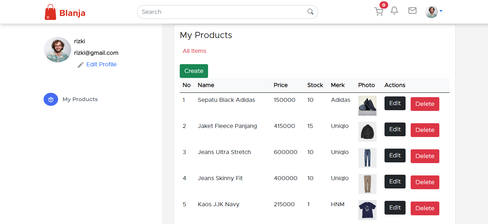
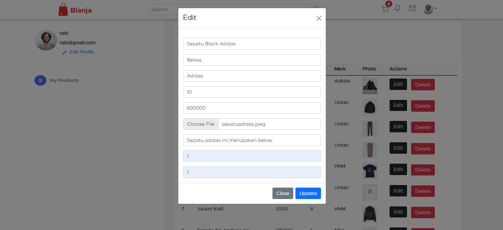

<div align="center">
  
</div>
<h3 align="center">Frontend Blanja Apps</h3>
<p align="center">
  <a href="https://frontend-blanja-apps.vercel.app/">View Demo</a>
</p>

<!-- ABOUT THE PROJECT -->

## About The Project

Blanja Apps is a web-based marketplace application. This application allows users to sell products and buy existing products. This Blanja application is built using ReactJS for the frontend.

### Technology Used

- [ReactJS](https://reactjs.org/)
- [Redux](https://redux.js.org/)
- [Bootstrap](https://getbootstrap.com/)
- [Socket.IO](https://socket.io/)
- [Axios](https://github.com/axios/axios)
- [Moment](https://momentjs.com/)

<!-- GETTING STARTED -->

## Getting Started

### Installation

- Clone This Repository

`git clone https://github.com/rizkirnasution/Frontend-BlanjaApps.git`

- Install Module

`npm install`

- Setting .env

```bash
REACT_APP_API_BACKEND =
```

### Executing program

- Run this project with `npm run start`.

<!-- SCREENSHOT -->

## Screenshot

### Login


### Register


### Home


### Profile Seller



### Detail product


### Create Product


### Edit Product



<!-- RELATED PROJECT -->

## Related Project

- [Backend Blanja Apps](https://github.com/rizkirnasution/Backend-BlanjaApps.git)
- [Backend Blanja Demo](https://blanja-backend2-production.up.railway.app/)

<!-- CONTACT INFO -->

## Contact Info

Contributors names and contact info:

1. Rizki Romadhona Nasution

- [Linkedin](https://www.linkedin.com/in/rizkiromadhonanasution)

## License

This project is licensed under the MIT License - see the LICENSE file for details
